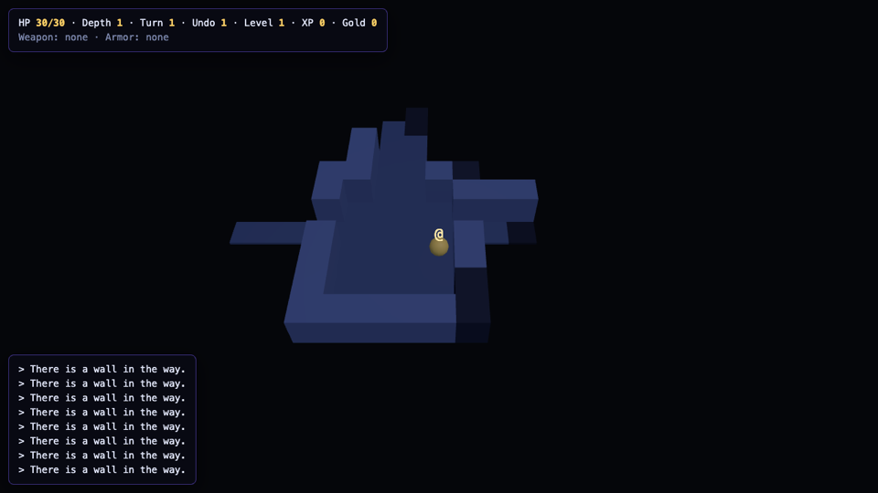
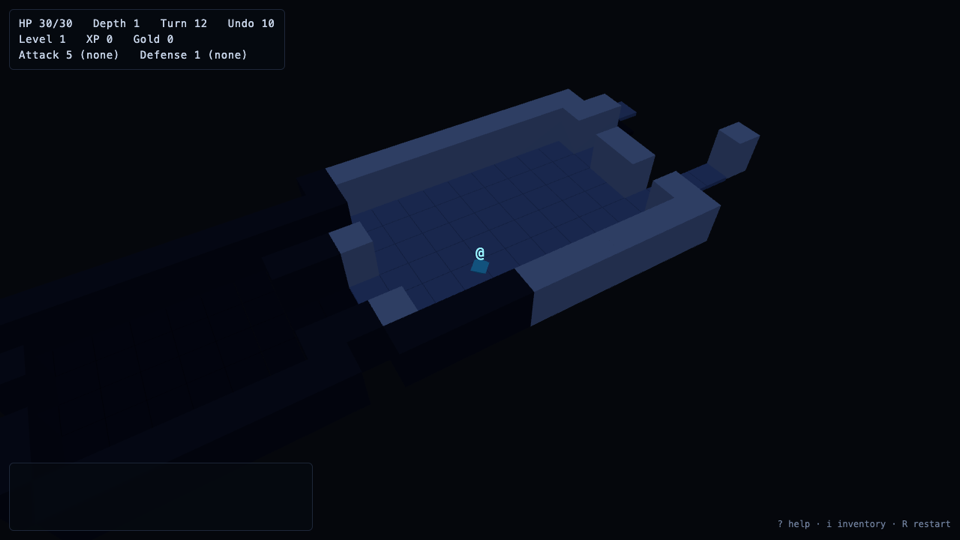
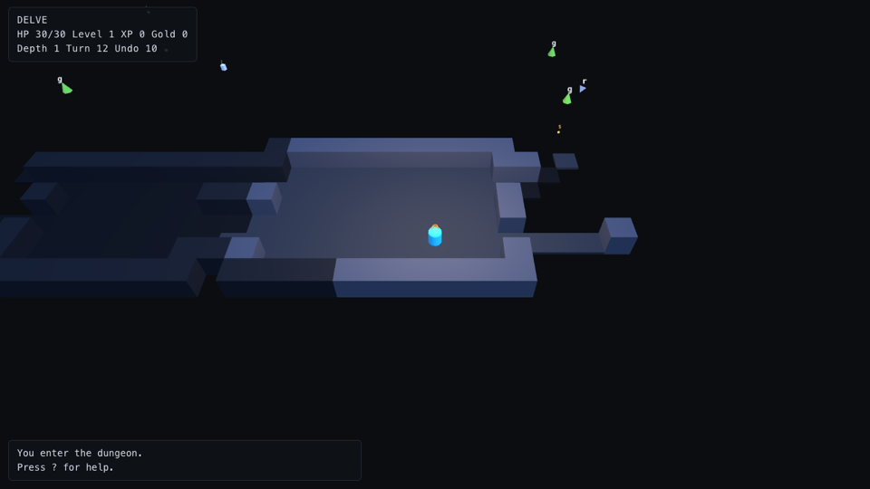

# magic vs. dsh on DeepSeek V4.1 Flash

A small, reproducible comparison between magic and DeepSeek's own harness, [dsh](https://www.npmjs.com/package/@deepseek-ai/dsh),
with both driving the same model: `deepseek-flash` (DeepSeek V4.1 Flash), the cheap model most people use with the DeepSeek API.
The question is not "which model is smarter" (it is the same model) but what the harness around it adds: does the work get done,
how much does it cost, and what can you see afterwards.

## Setup

| | dsh | magic |
|---|---|---|
| Version | `@deepseek-ai/dsh` 0.1.5-rc.2, `dsh --profile headless "<task>"` | this repository, headless through `dist/sessions.js` |
| Model | `deepseek-flash`, its default (`reasoningEffort: high`) | `deepseek/deepseek-flash`, effort `high` |
| Tools | its defaults (bash, read, write, edit, glob, grep, web, subagents, …) | its defaults (Read, Write, Edit, Bash, Glob, Grep, WebSearch, WebFetch, AskUserQuestion) |
| Prompt | the task text, verbatim, as the one user message | the same text |
| Questions to the user | none possible in headless mode | answered automatically with "no user is available, decide yourself" |
| Working copy | a fresh git repository per run, copied from `bench/fixtures/<task>` | same |

Four tasks of increasing size live in `bench/tasks/`; each has a hidden acceptance suite in `bench/checks/` that the agent never
sees. Every suite was validated against a hand-written reference solution before the runs.

| Task | What the agent gets | Hidden checks |
|---|---|---|
| `01-todo` | a 7-line todo store with one test; add `toggle`, `remove`, `count`, tests and a README | 8 |
| `02-kv` | an empty package; build a key-value CLI with TTL, atomic writes, exit codes, tests and a README | 10 |
| `03-library` | an empty package; build a library system: three modules, a JSON store, a seven-command CLI, fines, tests and a README | 15 |
| `04-invoicing` | an empty package; build an invoicing system: money in cents with half-up rounding, per-year invoice numbers, statuses, partial payments, aging and revenue reports, CSV export, an eleven-command CLI, tests and a README | 12 (about 90 assertions) |
| `05-dungeon` | an empty package with a screenshot tool; build DELVE, a turn-based roguelike with a deterministic core and a three.js renderer, then (phase 2) a ten-turn rewind | 15 + 6 |

magic runs in two ways: one ordinary session, which is the like-for-like comparison with dsh, and the project system
(planner, dispatcher, executors) for the tasks large enough to have structure.

Measured per run: hidden checks passed, whether the repository's own `npm test` is green, wall time, model requests, tool calls,
tokens (uncached input, cached input, output) and the cost at DeepSeek's list prices for `deepseek-flash`
($0.30 / $0.006 / $1.20 per million; off-peak halves it). dsh's numbers come from its session log
(`~/.dsh/sessions/…/session.v3.jsonl.zstd`, per-request `usage`), magic's from the session logs in `<workspace>/.magic/sessions/`
(`api.response` events). Both count reasoning tokens as output.

## Reproduce

```sh
export DEEPSEEK_API_KEY=…
npm install --prefix bench/dsh @deepseek-ai/dsh      # or DSH_PREFIX=/where/it/is
npm run build
node bench/run.mjs --label mine --task 01-todo,02-kv,03-library,04-invoicing --harness dsh,magic,magic-project --repeat 3
node bench/summarize.mjs bench/results/mine
node bench/run.mjs --label long --task 05-dungeon --harness magic-project --timeout-minutes 180 --checkpoint-minutes 5
node bench/curve.mjs bench/results/long
```

A task with a `<task>-phase2.md` prompt runs in two phases in the same workspace (magic continues its session or replans its
project; dsh starts a second headless run); `--checkpoint-minutes` re-runs the hidden suites on a timer, and the project runner
also runs them before approving each milestone. `bench/rescore.mjs` re-judges finished runs after a check file is corrected.

Each run leaves `bench/results/<label>/<task>/<harness>-<n>/` with `result.json`, the agent's output, the hidden check log, the
repository's own test log and the workspace itself (with magic's session logs, or a decoded copy of dsh's session). The
workspaces and raw session dumps stay on the machine that ran the benchmark; the records are committed. The magic runner imports
the compiled sources (`dist/`), so it runs from a source checkout of magic, not from the published package.

## Results

Run label `flash-v3` for the single-session rows (three runs per cell), `flash-v4` for the project rows; September 20, 2026;
the build of magic at commit 274c8ef plus the planner rule described below (the commit that added this folder) and `@deepseek-ai/dsh` 0.1.5-rc.2. Means over the runs.

| Task | Harness | All hidden checks passed | `npm test` green | Wall time | Model requests | Cost |
|---|---|---|---|---|---|---|
| `01-todo` (8 checks) | dsh | 3/3 | 3/3 | 0.4 min | 6 | $0.006 |
| | magic, one session | 3/3 | 3/3 | 0.3 min | 8 | $0.005 |
| | magic, project | 3/3 | 3/3 | 1.3 min | 22 | $0.025 |
| `02-kv` (10 checks) | dsh | 3/3 | 3/3 | 1.4 min | 12 | $0.023 |
| | magic, one session | 3/3 | 3/3 | 1.5 min | 17 | $0.024 |
| | magic, project | 3/3 | 3/3 | 5.1 min | 47 | $0.092 |
| `03-library` (15 checks) | dsh | 3/3 | 3/3 | 2.9 min | 25 | $0.050 |
| | magic, one session | 3/3 | 3/3 | 2.2 min | 19 | $0.040 |
| | magic, project | 3/3 | 3/3 | 8.5 min | 99 | $0.171 |
| `04-invoicing` (12 checks) | dsh | 3/3 | 3/3 | 5.6 min | 34 | $0.091 |
| | magic, one session | 3/3 | 3/3 | 3.5 min | 27 | $0.060 |
| | magic, project | 3/3 | 3/3 | 14.6 min | 138 | $0.286 |

The full per-run tables, with tool calls and token counts, are what `node bench/summarize.mjs bench/results/flash-v3` and
`… flash-v4` print; every run's `result.json` is in the repository.

### What the numbers say

- **Same model, same result.** Both harnesses solved every task in every run: 24 single-session runs, 24 passes on the hidden
  checks, 24 green test suites. DeepSeek V4.1 Flash is good enough for this size of task, and neither harness gets in its way.
- **magic's single session does the same work with less.** On the two larger tasks it needed fewer model requests and fewer tool
  calls, so it finished 25–40% sooner and cost 20–35% less: on `04-invoicing`, 3.5 vs 5.6 minutes and $0.060 vs $0.091. The
  output side is where the money goes at Flash prices (40K vs 62K output tokens per run on that task); dsh's runs make more
  round trips (its todo list tool alone accounts for 8 calls per run) and grow a larger context (0.96M vs 1.88M cached input tokens
  per run). On the two small tasks the harnesses are indistinguishable.
- **The project system works with a cheap model, at a known price.** Planner, dispatcher and executors took every task from goal
  to green in all twelve runs of the final build: 2–9 tasks and 1–5 milestones per project, no attempt failed its acceptance
  commands, and once a task reported itself blocked (a test written for an earlier milestone encoded expectations the later task
  had to change), the planner revised it and the second attempt passed. It costs four to five times a single session on tasks
  this small, and takes four to five times as long, because the planner writes a design document and a task tree first and every
  task gets a fresh session with the documents in its context. That overhead is the point on work that does not fit one
  session; it is not the mode for a ten-minute task, and the numbers say so.
- **What you get to look at afterwards.** magic leaves `<workspace>/.magic/sessions/<id>.jsonl` with every request as sent
  (system prompt, messages, tools), every response, every tool call and result, and the context measurement after each
  response; the project runs also leave `.magic/project/` with the design, the task tree with every attempt and its
  verification output, and `events.jsonl`. dsh keeps a zstd-compressed event log per session under `~/.dsh/sessions/`, with the
  messages, the stream chunks and per-request usage. Both are complete; magic's is plain text next to the code it describes, and
  it is what the web page shows live.

### What the benchmark found in magic

The first project runs (`flash-v1`) failed 4 of 6 planner turns: Flash writes the 12–20 KB `plan_write` call by hand and gets the
JSON wrong now and then (the tasks array written as an object keyed by id, so the first task never closes). magic's
Anthropic-format adapter used the SDK's stream helper to assemble responses, and that helper throws the whole response away when
one tool call's arguments do not parse, so the turn died with an error. Commit 274c8ef assembles the message in the adapter
instead, keeps the malformed call with its raw text, answers it with a tool error that says where the brackets went wrong, and
tells the planner the shape of the plan. `flash-v2` and `flash-v3` then showed Flash's planners writing elaborate acceptance
commands (inline node scripts, `cd` into temp directories, `git rev-parse` after leaving the repository) that failed for reasons
unrelated to the work and cost a replan; the planner rules now ask for short, robust acceptance commands and put detailed
verification into the task's own tests. `flash-v4` is the project system with both changes. Two hidden checks were also
corrected after the first runs, in the agents' favour: one required the error JSON on a single line where the task only said
"prints `{ "error": … }`", and one asserted a validation the task never asked for; every earlier run was re-scored with the
corrected files (`bench/rescore.mjs`), which is how the `03-library` and `04-invoicing` rows became 3/3 for both harnesses.

## The long run: DELVE, a 3D roguelike in two phases

The four tasks above fit one session. `05-dungeon` is the tier built to run for hours: a turn-based roguelike with a
deterministic core (seeded generator, room-and-corridor levels, a specified field-of-view rule, shortest paths, deterministic
combat, items and equipment, five depths, save and load, a stable state hash, key scripts) and a three.js renderer, then a second
phase that adds a ten-turn rewind touching every part of the state. The spec is `bench/tasks/05-dungeon.md` (2,400 words of
contract); the hidden suites (`05-dungeon.check.mjs`, 15 tests, and `05-dungeon-phase2.check.mjs`, 6 tests) compare the core with
reference algorithms, replay scripts for determinism, run random play against the invariants, load the page in headless Chrome
and scan the sources for eval, vm, child processes and network use; both were validated on a hand-written reference first. The
fixture ships a `screenshot` tool (headless Chrome with WebGL, returns the picture and the console) so the agent can see what it
draws: magic's runs call it as a tool, dsh's as a command with its own image reader. The runner re-runs the hidden suites every
five minutes and at every milestone, so each run leaves a curve, not just an end score.

| | dsh, one session | magic, one session | magic, project |
|---|---|---|---|
| Round 1: game (15) + rewind (6) | 15 + 6 · 48 min · $0.37 | 13 + 6 · 79 min · $0.38 | 15 + 6 · 136 min · $1.68 |
| Round 2: game (15) + rewind (6) | 15 + 6 · 45 min · $0.34 | 15 + 6 · 57 min · $0.31 | 12 + 6 · 99 min · $1.18 |
| Model requests · tool calls (round 1) | 163 · 193 | 143 · 186 | 720 · 825 |
| Screenshots looked at (round 1 / 2) | 8 / 8 | 37 / 25 | 85 / 104 |
| Tests the agent wrote (round 1 / 2) | 80 / 83 | 79 / 92 | 211 / 132 |
| Structure (round 1) | one session | one session, 240K tokens of context at the end | 19 tasks, 5 milestones, 42 sessions, 4 replans, 3 blocks |
| Structure (round 2) | one session | one session | 14 tasks, 4 milestones, 27 sessions, 1 replan, no block |

Labels `delve-v1` and `delve-v2`; round 2 ran after the planner rule about test ownership was added (nothing else changed for
the single sessions). One run per cell per round, so a check or two is noise. The misses were contract details, not broken
games: magic's round-1 session picked the stairs room by integer centres and did not return the level-up message; the round-2
project build logged monster attacks and the death message but did not return them from `act()`, which cost three checks
for one deviation.

The curves (`node bench/curve.mjs bench/results/delve-v1`) tell the story better than the totals: the single sessions had 11
or 12 of the 15 checks passing after ten minutes and crept up by one or two over the next half hour; the project system had
nothing loadable for ten minutes, 8 at fifteen, 13 when its first milestone (the core) closed at minute 36, and all 15 from
minute 60, and it held them while the renderer, the docs and the rewind were built on top. Its two dips (13 to 12 at minute
35, 15 to 14 at minute 105) were tasks rewriting shared code, and both were gone by the next checkpoint. The first of them is
the run's most useful event: the monsters task reported itself blocked because an earlier task's tests asserted the old
behaviour and were outside its file scope, the planner widened the scope, and the second attempt passed. The same pattern
caused every block in this run and in the library run (4 of 4), which is why the planner rules now say that a task owns the
tests of the behaviour it changes; in round 2, with that rule, the project had no block, one replan instead of four, and took
99 minutes instead of 136.

<p align="center">
    
</p>
<p align="center"><sub>Seed 11 after the same twelve moves: dsh's session, magic's session, magic's project system. The project build draws monsters outside the field of view, a renderer bug no check covers.</sub></p>

What this tier says, honestly:

- **At two hours, one session does not run out of structure yet.** With a million-token model and cheap cached input, one
  session built the whole game and the rewind in 45 to 80 minutes for about $0.35, and three of the four single-session runs
  passed everything. The premise that compaction loses structure did not bite at this length; it may at a day's length, which
  this benchmark cannot yet run.
- **The project system reached full marks once in two rounds, at three to four times the cost and about twice the time of a
  session.** What the money bought is visible in the record rather than in the score: a 17 KB design document, 14 to 19 tasks
  with acceptance commands, milestone checkpoints a user could have tried, 132 to 211 tests, a blocked task that explained
  itself and a planner that fixed the plan, and every request in a session log. On this evidence the project system is the
  way to get a verifiable, resumable build with a paper trail, not a cheaper or better one.
- **Screenshots made the renderer real.** Every configuration used the picture; the project's executors took 85 and 104.
  Some of the games still have visible defects the checks do not measure (the round-1 project build draws monsters outside
  the field of view), so the numbers describe the contract, not the game's feel.
- **Three checks were corrected after the run, all in the agents' favour** (a HUD capture that stopped at the first closing tag,
  a comment that mentioned Math.random counted as a call, a rewind assertion that contradicted the spec's own hash rule);
  every run was re-scored on its final workspace and the table shows the corrected numbers, while the curves show what the
  checkpoints recorded at the time.

### Caveats

Four tasks, three runs each, one model, one day: enough to see that the harnesses are on par for correctness and that magic's
session is leaner, not enough to rank them by a few percent. Wall time depends on the API's mood; both harnesses ran at the same
hours, interleaved. dsh ran at its defaults in headless mode; a different profile or prompt could change its numbers, as a
different system prompt could change magic's. The hidden checks are strict about the specified behaviour and silent about
everything else, so they measure "did it do what was asked", not code quality.
